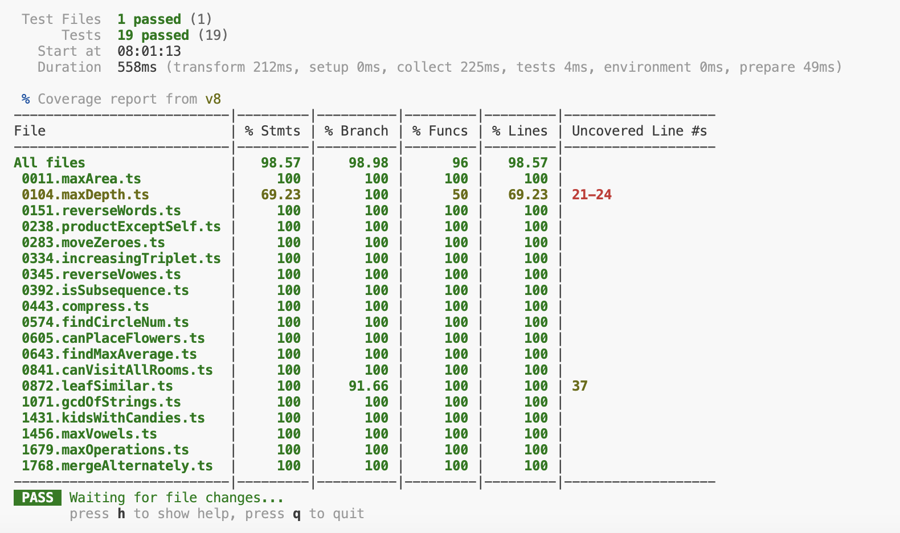

**LeetCode 75** | timeframe: 1 week | language: typescript

***task***
- [x] use this repository to monitor progress as I go through each challenge
- [x] setup a typescript project and use vitest to test
  * run ```npm run test:coverage```
  
